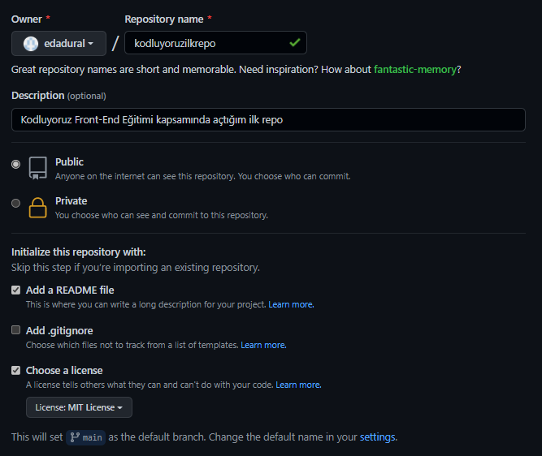

# Kodluyoruz Ilk Repo
---
Bu repo [Kodluyoruz](kodluyoruz.org) Front-End Eğitiminde oluşturduğumuz ilk repo. İçerisinde bir adet README dosyası, bir adet de index.html barındırıyor.



## Installation
---
### Öncelikle projeyi clonelayın.

``` 
git clone https://githup.com/edadural/kodluyoruzilkrepo.git
```

## Usage
---
Projeyi cloneladıktan sonra Visual Studio Code programını açınız.

```
cd kodluyoruzilkrepo
code .
```

## License
---
[MIT](https://choosealicense.com/licenses/mit/)